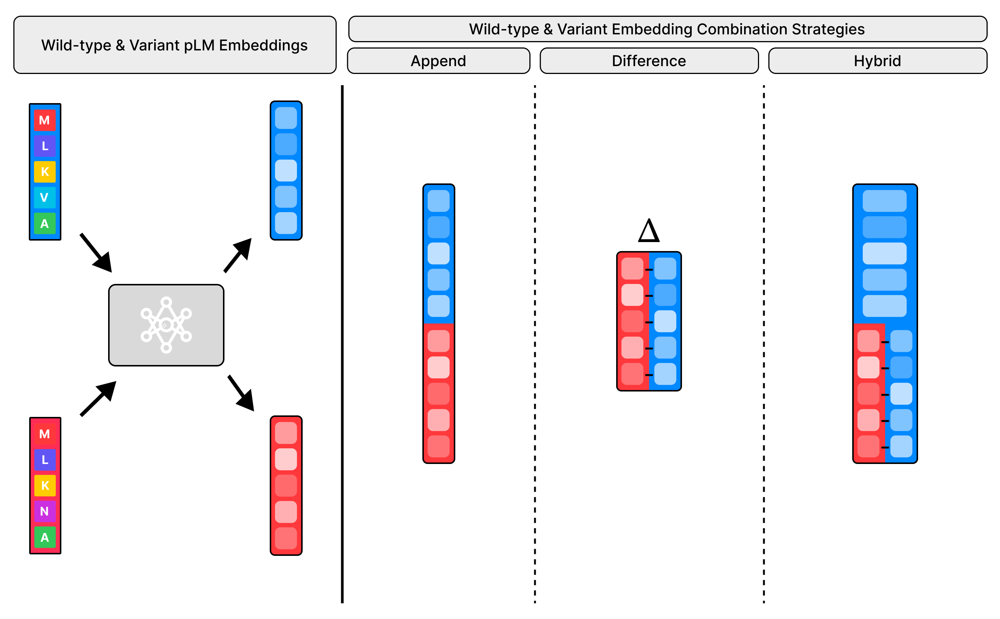
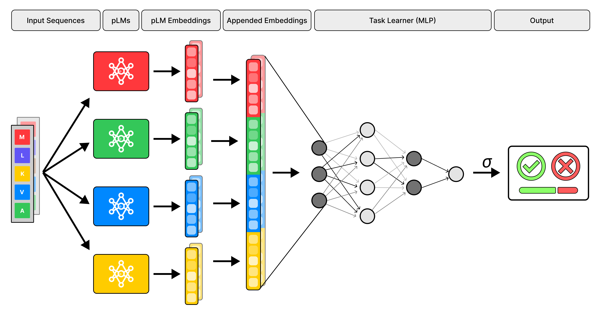
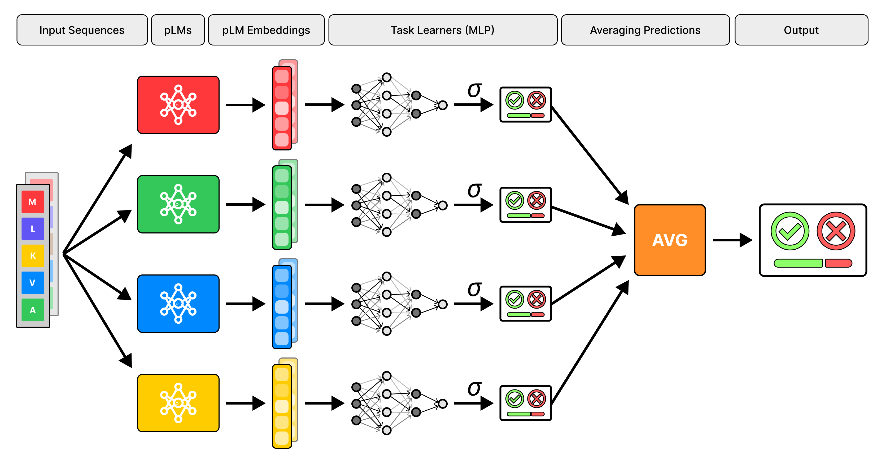
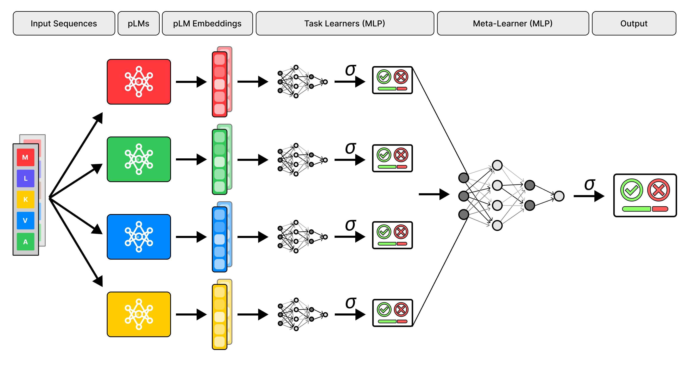
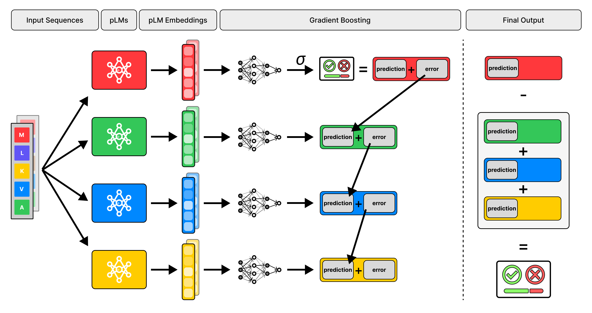

# Exploring pLM Ensembles
***Analyzing How Protein Language Models Can Be Combined to Improve Downstream Predictive Performance***

This is the GitHub repository of my master thesis at the VUB. The thesis text can be found in the root of this repository.

## Abstract
Protein Language Models (pLMs) have been shown to capture meaningful patterns from large protein sequence datasets such as UniRef, generating latent representations of proteins that can be used to train predictive models for downstream tasks in bioinformatics. In this thesis, we implemented and evaluated multiple methods for combining a selection of twelve different pLMs varying in specialization, size, base architecture, and training objective, and analysed their effects on predictive performance using the DRGN dataset, which was used as a binary classification task for cancer driver mutations. We experimented with feature-level and decision-level, as well as parallel and layered ensemble architectures, in addition to three distinct strategies for combining wild-type and variant sequences. Furthermore, we analysed which pLMs contributed most to the predictions, and which combinations yielded the best predictive performance. The results show that using exclusively the difference between the wild-type and variant representations leads to the best predictive performance, as it forces the task learners to focus on mutation-specific information while avoiding an increase in input dimensionality, unlike the other two variant combination strategies. Additionally, our experiments indicate that the predictive performance of pLM combinations depends strongly on their interaction: some embedding spaces complement each other, while others partially overlap or even dominate one another depending on the pairing. Overall, ESM-2, UniRep, and Ankh3 produced the most informative embeddings with respect to the downstream task considered in this study.  

## File Structure Overview

```bash
.
├── datasets        # The DRGN dataset
├── ensemble_models # The implementation of the ensemble architectures
├── pipelines       # The implementation of the pipelines
├── plm_models      # The wrappers of the pLMs
├── scripts         # Scripts to run the pipelines
└── thesis.pdf      # Full thesis text

```

## Instructions
As mentioned in the paper, there are two separate pipelines that need to be run sequentially to run this project: the first pipeline to pre-compute the embeddings and the second pipeline to train the ensemble models. 


First, the necessary pip modules should be installed:

```bash
pip install -r requirements.txt
```

It is recommended to use Python 3.11

### Embedding Pre-Computation Pipeline
This script will load all twelve pLMs one by one, computing and saving its embeddings for all protein sequences in the DRGN dataset.

To run this script, execute the following command:

```bash
python -m scripts.0_embedding_computation.compute_embeddings.py
```

### Ensemble Training Pipelines
In order for this script to work, the embedding pre-computation pipeline should be run first.

#### Experiment 1 (Wild-Type & Variant Combination Strategies)
This script will train many ensemble models with different pLM combinations, which were used to get the results for the first experiment.
The first experiment entails the comparison of downstream predictive performance of the three wild-type & variant embedding combination strategies presented in the figure below.



To run this script, execute the following command:

```bash
python -m scripts.1_mutation_strategy_experiment.1_mut_comb_run_script.py
```

#### Experiment 2-4
This script will train all ensemble models necessary to get the results needed for the last three experiments in the paper:

- Experiment 2: Individual pLM Performance
- Experiment 3: Ensemble Architecture Performance
- Experiment 4: Feature-Level pLM Combination Analysis

To run this script, execute the following command:

```bash
python -m scripts.2-4_ensemble_types_experiment/1_combination_run_script.py
```

## Overview of the Ensemble Architectures

<p align="center"><i>Diagram of the Representation Fusion Ensemble Architecture</i></p>


<p align="center"><i>Diagram of the Task-Level Ensemble Architecture</i></p>


<p align="center"><i>Diagram of the Task-Level with Meta-Learner Ensemble Architecture</i></p>


<p align="center"><i>Diagram of the Task-Level with Meta-Learner Ensemble Architecture</i></p>
